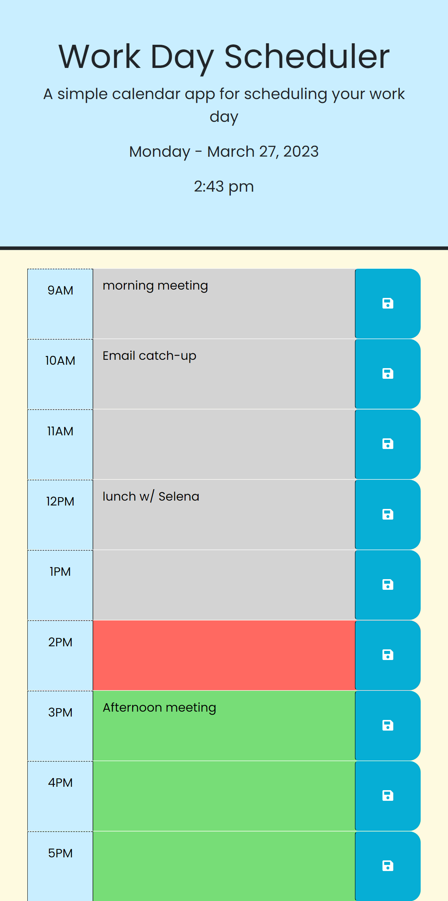

# work-day-scheduler
Work Day Schedule using 3rd party APIs (jQuery/Day.js)

## Description

This is a simple calendar application that allows the user to input tasks for the current work day and edit those as needed.  This was an opportunity for me to utilize several new skills recently learned including jQuery, local storage, and Day JS.  

## Usage

The header includes a title and dynamically changing date/time information using Day JS API.  The description portion of each hour time block can be edited as needed and saved to local storage by clicking the save button on the right of each hour block.  Each hour time block will change color depending on if it is past, present or future as well (red for present, gray for past, and green for future).  If the browser or page is closed, and reopened then previously saved data will restore to the page as it is saved in local storage.

## Application link:

https://gmgabrie.github.io/work-day-scheduler/

## Credits

The starter code for this application was provided by the bootcamp.  Several modifications were made to make the page functional and to customize colors and other minor cosmetic features.  

## Features

- Dynamically updating date and time in the header using Day JS.
- Saving/retreiving of data to/from local storage.
- Dynamic color changing of hour time blocks using Day JS and JavaScript.